共同开发规范
===
[TOC]

> 记一下项目开发的规范，统一开发规范可以有效提高共同开发效率和代码质量
> 本文档图片的 winsoullin 理解为团队正式发布的仓库，Nightnessss 理解为个人仓库

## Fork原项目
进入目标仓库，`fork`项目到自己的仓库
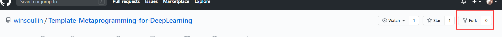

`fork`完后可以再自己的`GitHub`中找到这个仓库
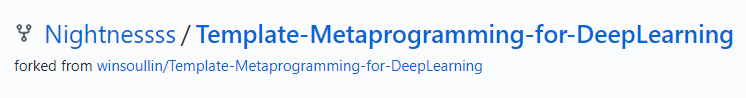
## 创建你的主题分支
1. 将自己`GitHub`的仓库`clone`到本地
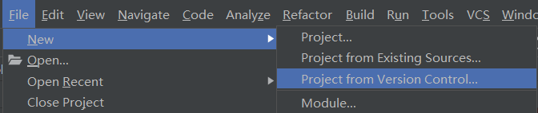
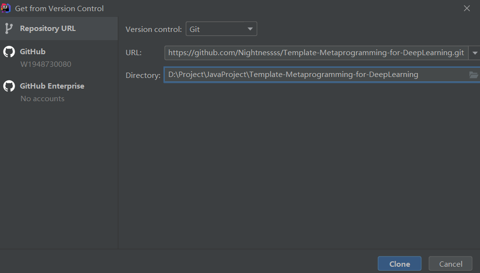

2. 创建新分支，分支命名尽量与改动需求相关
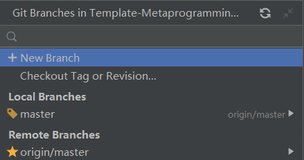
创建完后可以在`local branches`看到
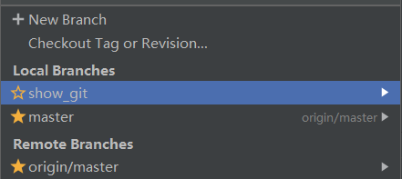
## 代码上传
1. 在新建的分支下进行开发
2. 开发完后提交`commit`，[commit格式](README.md#commit规范)
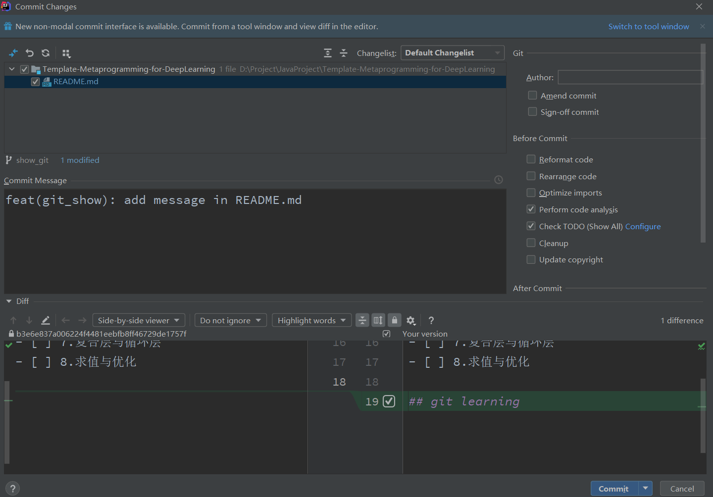
3. `push`代码，注意远程仓库为个人仓库，新建与本地分支同名的远程分支
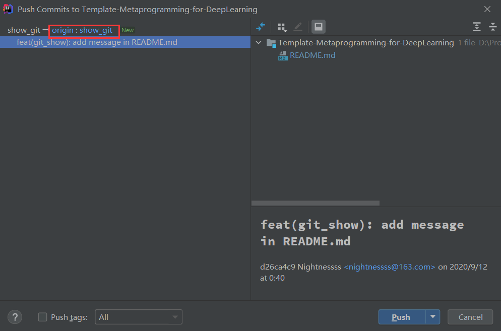

## 发送Pull Request

1. 在个人仓库选中刚刚提交的分支，点击`pull request`
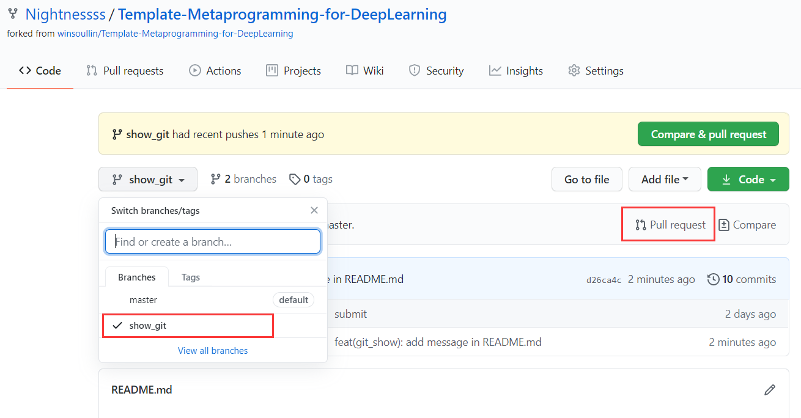
2. 创建`pull request`，注意目标仓库分支和源仓库分支
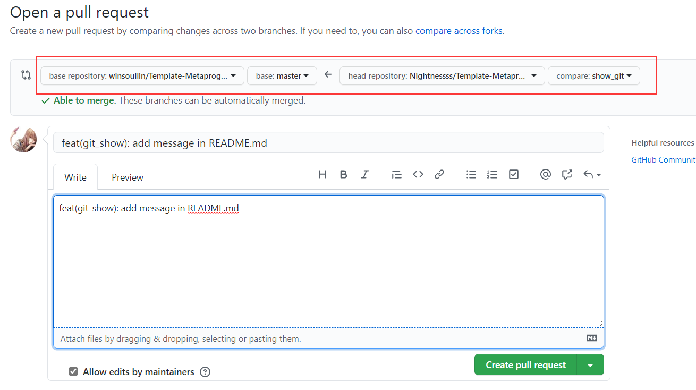
3. 提交完后可以在`pull request`查看信息
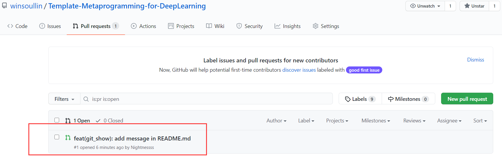
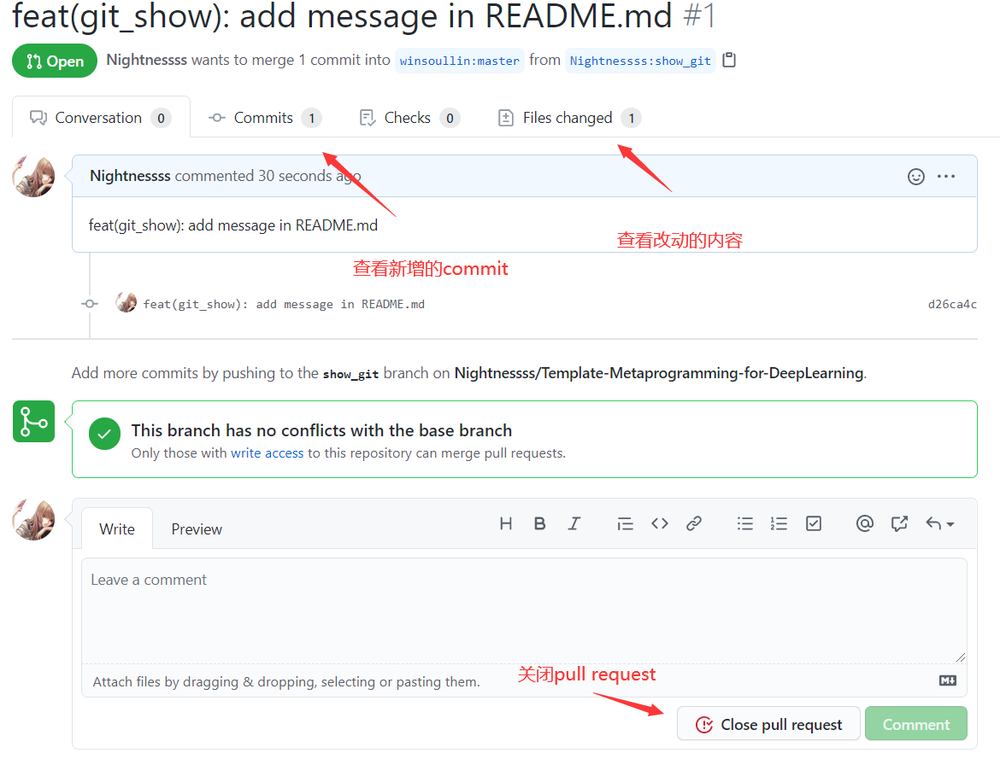
4. 为这个`pull request`指定`reviewers`和`assignees`，或者直接把连接发给某人，帮你检查合并代码
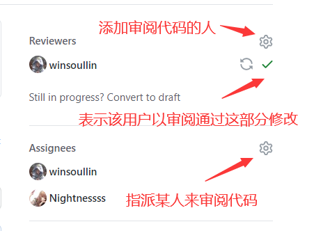
5. 之前都是开发者视角，现在开始是审阅人的视角，审阅人可以在修改的代码段添加评论
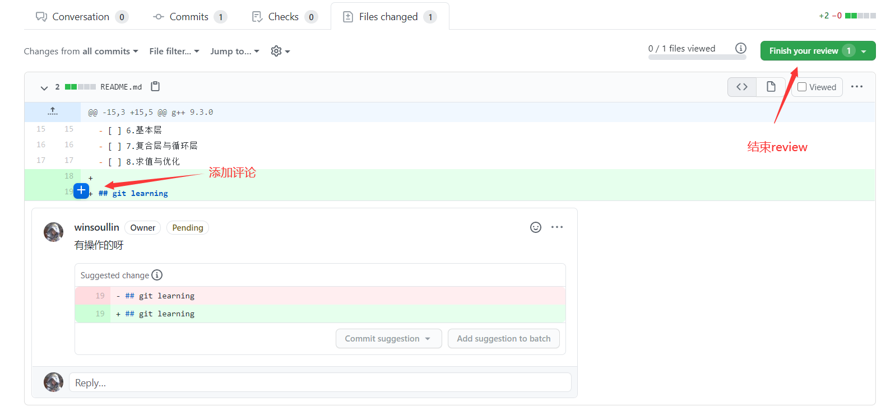
6. 如果代码没问题，可以`approve`(只有`reviewers`有`approve`权限)，并评论`LGTM`(Look Good To Me[狗头])
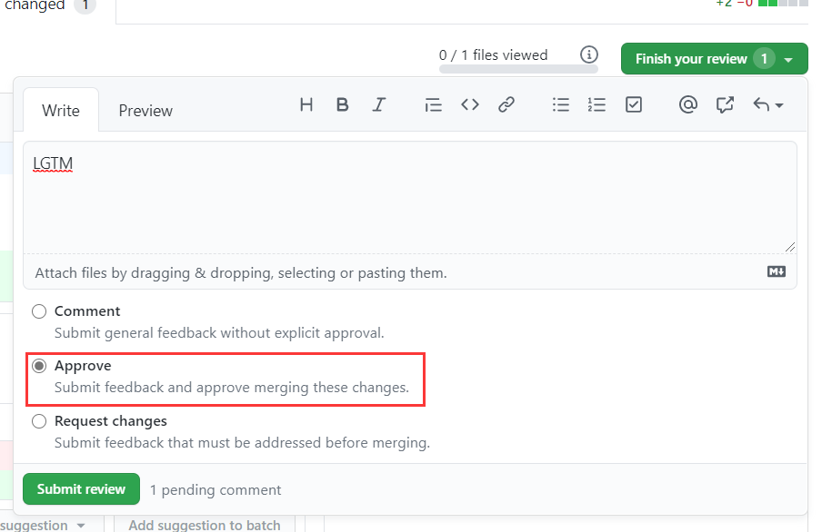
1. 仓库管理员`merge pull request`
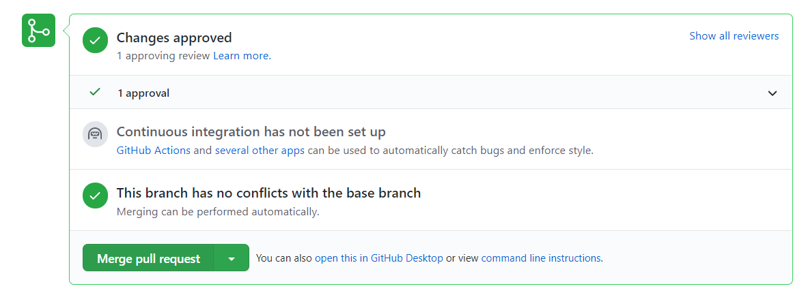

---

参考文章: https://blog.csdn.net/yxys01/article/details/78316649
